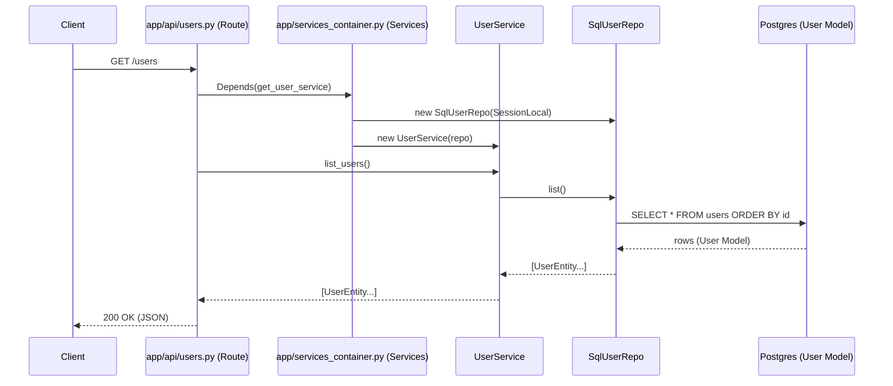

```mermaid
    sequenceDiagram
        participant Client
        participant API as app/api/users.py (Route)
        participant Ctn as app/services_container.py (Services)
        participant Svc as UserService
        participant Repo as SqlUserRepo
        participant DB as Postgres (User Model)

        Client->>API: GET /users
        API->>Ctn: Depends(get_user_service)
        Ctn->>Repo: new SqlUserRepo(SessionLocal)
        Ctn->>Svc: new UserService(repo)
        API->>Svc: list_users()
        Svc->>Repo: list()
        Repo->>DB: SELECT * FROM users ORDER BY id
        DB-->>Repo: rows (User Model)
        Repo-->>Svc: [UserEntity...]
        Svc-->>API: [UserEntity...]
        API-->>Client: 200 OK (JSON)
```
