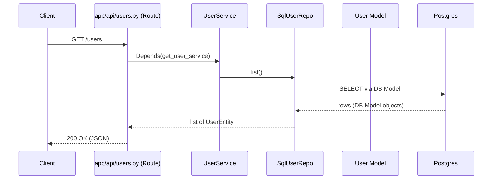

```mermaid
    sequenceDiagram
      participant Client
      participant API as app/api/users.py (Route)
      participant SVC as UserService
      participant REPO as SqlUserRepo
      participant ORM as User Model
      participant DB as Postgres
    
      Client->>API: GET /users
      API->>SVC: Depends(get_user_service)
    
      SVC->>REPO: list()
      REPO->>DB: SELECT via DB Model
      DB-->>REPO: rows (DB Model objects)
      REPO-->>API: list of UserEntity
    
      API-->>Client: 200 OK (JSON)
```
